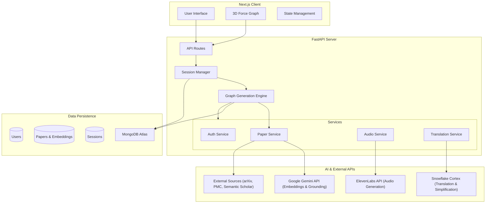

# 💎 Prismarine 💎

Prismarine is a research exploration tool that transforms flat lists of papers into an **interactive 3D universe**. By leveraging advanced AI, it visualizes semantic connections between papers.

## Hackathon Defense

### 🛠️ Functionality (35%) - *Seamless & Efficient*
- **Real-time 3D Rendering:** Smooth, high-performance visualization of hundreds of papers using `react-force-graph-3d` and Three.js.
- **Instant Search & Grounding:** Powered by Google Search Grounding to find relevant papers in milliseconds.
- **Fail-Safe Data Fetching:** Robust backend handles rate limits and API failures from arXiv, PMC, and Semantic Scholar gracefully.

### 💡 Innovation & Creativity (25%) - *Original & Feasible*

- **Semantic Discovery:** Instead of using the reference page to find related papers, our algorithm searches for papers with similar content using Vector Embeddings, revealing hidden connections across fields.
- **Accessible Research:** We don't just show papers; we *explain* them.
    - **Audio Narration:** Listen to paper summaries on the go (ElevenLabs).
    - **Code-Mixed Translation:** Simplifies complex technical jargon into "Hinglish", "Spanglish", etc., using **Snowflake** to break down language barriers.

### ⚙️ Technical Complexity (20%) - *Advanced Tech Integrated*
- **Multi-Model AI Pipeline:**
    - **Google Gemini:** For vector embeddings (768d) and search grounding.
    - **Snowflake:** For intelligent translation and technical term preservation.
    - **ElevenLabs:** For high-fidelity text-to-speech.
- **Complex Graph Algorithms:** Real-time cosine similarity computations and K-Nearest-Neighbor linking in the backend.

### 🎨 UX & Design (10%) - *Intuitive & Aesthetic*
- **Immersive Dark UI:** A premium aesthetic with glassmorphism and fluid animations using `framer-motion`.
- **Interactive 3D Space:** Zoom, rotate, and click nodes to explore the citations universe.
- **Responsive Design:** Works on all devices including web and mobile.

## Architecture

## Key Features

### 1. 2D & 3D Similarity Graph
Visualize the research landscape. Papers are nodes; relationships are edges. The similarity of each node between the root is visualized through the distance between them.

Hover over a node to see the paper title and abstract. Click and hold on a node to see the the directly connected nodes and relationships. Click on a node to see the paper details.

### 2. Smart "Code-Mixed" Translation
Understanding a paper in a second language is hard. We use **Snowflake Cortex** to translate summaries while **preserving technical terms** in English.
- *Example:* "The neural network optimizes loss" -> "Ye **neural network** loss ko optimize karta hai" (Hindi/English mix).

### 3. Audio Briefs
Turn any paper abstract into a high-quality audio brief using **ElevenLabs**, perfect for consuming research while commuting.

## Tech Stack

### Frontend
- **Framework:** Next.js 16 (App Router)
- **Styling:** Tailwind CSS v4
- **Visualization:** `react-force-graph-3d`, `three.js`
- **Animation:** `framer-motion`
- **Rendering:** 

### Backend
- **Framework:** FastAPI (Python 3.10+)
- **Database:** MongoDB (Motor async driver)
- **AI Integration:** `google-genai` SDK, Snowflake Connector

## 📦 Deployment

The project is dockerized and deployed via Coolify.

## 📄 License

MIT License. Built for CTRL+HACK+DEL 2.0
